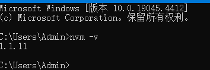
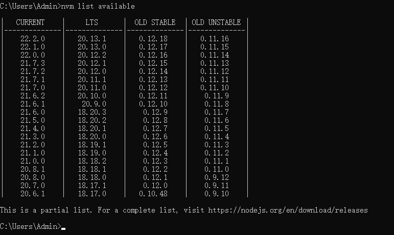
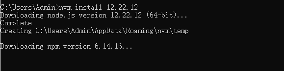
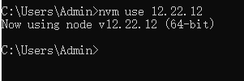
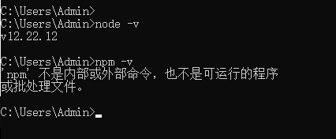
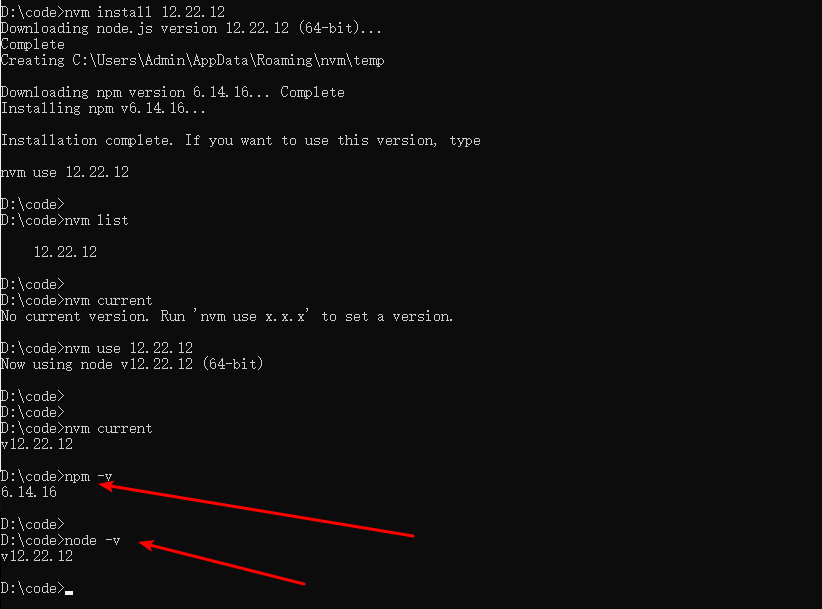

# gulimall-admin-vue-app
谷粒商城后台管理系统-[前端系统仓库](https://github.com/hello-github-ui/gulimall-admin-vue-app)

## 正确安装 NodeJS

### 先卸载 NodeJS

### How to remove Node.js from Windows:

1. Take a deep breath.
2. Run `npm cache clean --force`
3. Uninstall from Programs & Features with the uninstaller.
4. Reboot (or you probably can get away with killing all node-related processes from Task Manager).
5. Look for these folders and remove them (and their contents) if any still exist. Depending on the version you installed, UAC settings, and CPU architecture, these may or may not exist:

- `C:\Program Files (x86)\Nodejs`
- `C:\Program Files\Nodejs`
- `C:\Users\{User}\AppData\Roaming\npm` (or `%appdata%\npm`)
- `C:\Users\{User}\AppData\Roaming\npm-cache` (or `%appdata%\npm-cache`)
- `C:\Users\{User}\.npmrc` (and possibly check for that without the `.` prefix too)
- `C:\Users\{User}\AppData\Local\Temp\npm-*`

1. [Check your `%PATH%` environment variable](https://stackoverflow.com/questions/141344/how-to-check-if-directory-exists-in-path) to ensure no references to `Nodejs` or `npm` exist.
2. If it's *still* not uninstalled, type `where node` at the command prompt and you'll see where it resides -- delete that (and probably the parent directory) too.
3. Reboot, for good measure.

本内容参考自：[移除NodeJS](https://stackoverflow.com/questions/20711240/how-to-completely-remove-node-js-from-windows)

### 安装 nvm

***★ 如曾安裝過 Node.js，需在安裝 nvm-windows 前先移除完畢，\***[***移除方法\***](https://stackoverflow.com/questions/20711240/how-to-completely-remove-node-js-from-windows)***。\***

### NodeJS 版本控制安装

> 🍌本内容参考自：https://medium.com/@ray102467/nvm-windows-%E7%AE%A1%E7%90%86-windows-node-js-%E7%89%88%E6%9C%AC-68d789cf84d7

- 安装 [nvm-windows](https://github.com/coreybutler/nvm-windows/releases/tag/1.1.11)

> 安装完成后，打开cmd，输入 `nvm -v` 测试是否安装成功。



- 查看当前 NodeJS 版本

`nvm list available`



- 安装 `12.22.12` 版本的 NodeJS，并修改 `package.json` 中的 node-sass 的版本为： 

```json
"node-sass": "4.14.1"
```



- 启用刚安装的 NodeJS 版本

```bash
nvm use 12.22.12
```



- 测试 NodeJS 版本

```bash
node -v
npm -v
```



**如果出现像上图中显示的 `npm -v` 出错，则需要通过 nvm 卸载掉 nodejs，重新从来再来安装一次 nodejs，多试几次**。



## 依赖安装

> 要想使 `npm install` 不报错并顺利安装完，需要如下两个前提：
>
> - 安装的 `NodeJS` 的版本不能太新，建议使用 `v12.22.12`
> - 修改 `package.json` 中 node-sass 的版本为： `"node-sass": "4.14.1"` 
> - 至于 `python` 的版本，应该没关系，不过我本地使用的是 `Python 2.7.16`
>
> 之后就可以正常安装完了，不用使用 cnpm

# gulimall
谷粒商城后台管理系统-[后端系统仓库](https://github.com/hello-github-ui/gulimall)


## renren-fast-vue

- renren-fast-vue基于vue、element-ui构建开发，实现[renren-fast](https://gitee.com/renrenio/renren-fast)
  后台管理前端功能，提供一套更优的前端解决方案
- 前后端分离，通过token进行数据交互，可独立部署
- 主题定制，通过scss变量统一一站式定制
- 动态菜单，通过菜单管理统一管理访问路由
- 数据切换，通过mock配置对接口数据／mock模拟数据进行切换
- 发布时，可动态配置CDN静态资源／切换新旧版本
- 演示环境：http://demo.open.renren.io/renren-security


## 说明文档

项目开发、部署等说明都在[wiki](https://github.com/renrenio/renren-fast-vue/wiki)中。

## 更新日志

每个版本的详细更改都记录在[release notes](https://github.com/renrenio/renren-fast-vue/releases)中。
